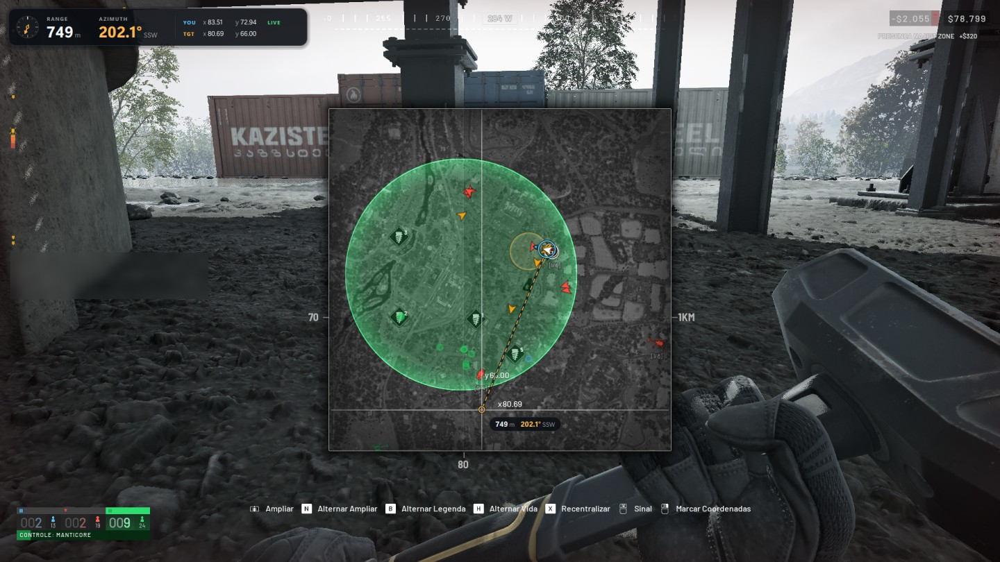
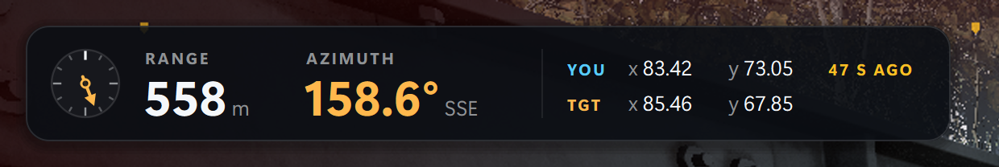

# Wardogs Spotter

[](https://github.com/gabriiellfr/wardogs-spotter/actions/workflows/ci.yml)


[](https://github.com/astral-sh/ruff)
[](LICENSE)

Reads the Wardogs in-game map off the screen and shows the range and azimuth
from you to your target, in a HUD drawn over the game.



Open the map and move the mouse over it. The HUD works out where you are and
gives the range and azimuth to the point under the cursor. Close the map and
the numbers stay on screen while you aim.



[Install](#install) · [Usage](#usage) · [How it works](#how-it-works) · [Known limits](#known-limits) · [Development](#development)

## What it does

- Finds the map wherever it opens, reads the coordinates the game prints next
  to the cursor, and finds your arrow and the way it points.
- Follows the map as you pan and zoom to work out its scale, so it knows your
  coordinates without you hovering your own arrow.
- Shows the range in meters and the azimuth in degrees (clockwise from north,
  like the in-game compass) to the last point the mouse was on, and keeps
  them after the map closes, with the age of your position next to them.
- Draws it in a transparent window over the game that never takes a click or
  the focus.

## What it does not do

- It does not touch the game's process: no injection, no memory reading, no
  process handle. The game is found by its window title and captured through
  Windows Graphics Capture, the way OBS captures a window.
- It sends no input. No key or mouse event ever comes from it.
- It uses no network.
- It does not give the mortar's elevation yet, only range and azimuth. See the
  [roadmap](#roadmap).

> [!IMPORTANT]
> The program only reads pixels that are already on your screen, but whether a
> tool like this is allowed is for the game's rules to say. Read them. You use
> it at your own risk.

## Requirements

- Windows 11. It is developed and tested there; Windows 10 is untested.
- The game at 1920x1080, borderless or windowed. Windows can't draw over a
  game in exclusive fullscreen, and the characters the reader knows were cut
  from 1080p screenshots (see [Known limits](#known-limits)).
- Python 3.11 or newer, only if you run it from source.

## Install

### Download

Get `wardogs-spotter-<version>-windows-x64.zip` from the
[latest release](https://github.com/gabriiellfr/wardogs-spotter/releases/latest),
unzip it anywhere and run `wardogs-spotter.exe`. It needs no Python.

> [!NOTE]
> The executable is not signed, so Windows SmartScreen asks before running it
> the first time: choose "More info", then "Run anyway". Some antivirus
> programs distrust executables built with PyInstaller as a class. The
> `.sha256` file next to the zip lets you check the download, and the
> [release workflow](.github/workflows/release.yml) shows how it is built.

### From source

With [uv](https://docs.astral.sh/uv/):

```powershell
git clone https://github.com/gabriiellfr/wardogs-spotter
cd wardogs-spotter
uv sync
uv run wardogs-spotter
```

With pip:

```powershell
git clone https://github.com/gabriiellfr/wardogs-spotter
cd wardogs-spotter
py -m venv .venv
.venv\Scripts\activate
pip install .
wardogs-spotter
```

## Usage

Start it before or after the game: it waits for the game's window and finds
it again if the game restarts. With the download, double-clicking
`wardogs-spotter.exe` runs the HUD; for the other commands, open a terminal in
its folder and type `.\wardogs-spotter.exe` where the table says
`wardogs-spotter`. From source with uv, put `uv run` in front.

| Command | What it does |
| --- | --- |
| `wardogs-spotter` | Draws the HUD over the game. |
| `wardogs-spotter preview` | Shows the capture in a window, with the HUD and the reader's numbers. For checking that the capture and the reader work. |
| `wardogs-spotter preview --replay` | The same on the screenshots saved with `F8`, played in a loop. No game needed. |
| `wardogs-spotter read [IMAGES]` | Reads saved screenshots (the ones `F8` saved, if none is named), prints what each gave, and saves copies with the reading marked in a `read/` folder next to them. |
| `wardogs-spotter learn IMAGE --labels "y109.58 x99.23"` | Teaches the reader the characters of a screenshot it can't read. |

`wardogs-spotter --help` and `wardogs-spotter COMMAND --help` list the options:
`--hud-scale` to make the HUD larger or smaller, `--screenshots` to choose
where screenshots go, `--title` and `--window-class` if the game's window is
ever named differently.

### Getting your position

The game prints coordinates only for the point under the cursor, so the
program needs one of these:

1. **Put the cursor on your own arrow.** The coordinates printed there are
   yours, exactly.
2. **Move the cursor across the map.** Two readings at least 30 pixels apart
   give the map's scale, and with it the coordinates of your arrow. This
   happens by itself when you move the mouse towards a target.

After that the position follows the map through pans and zooms, and stays in
the HUD after the map closes. The HUD says `LIVE` while the position comes
from the frame on screen, and how old it is otherwise: walk away from where
you opened the map and the solution is for the place you left.

### Hotkeys

They work while the game has the focus, and the game still gets the key.

| Key | Action |
| --- | --- |
| `F8` | Saves a screenshot with the HUD on it to `screenshots/`, and the game's own image to `screenshots/raw/`. |
| `F9` | Hides or shows the HUD. |
| Tray icon | The same, plus opening the screenshots folder and quitting. `Ctrl+C` in the terminal quits too. |
| `S`, `Q` or `Esc` | In the preview window: save a screenshot, quit. |

The image in `raw/` is the one the `read` and `preview --replay` commands
take, and the one to attach to a bug report. The capture never contains the
HUD, so a picture with the HUD on it can't stand in for it: its marks would
be read as part of the map.

## How it works

```
game window --> capture --> map reader --> state --> HUD
                the way     panel          position  bar, marks
                OBS does    coordinates    target    on the map
                            arrow, scale   solution
```

Each frame goes through four steps:

1. **Find the map.** The panel's border and the crosshair are thin bright
   lines. Looking for rows and columns that are brighter than their
   neighbors finds both, wherever the map opens.
2. **Read the coordinates.** The game prints `y109.58` above `x99.23` next to
   the crosshair. Each character is compared with 211 examples cut from real
   screenshots and takes the name of the best match. No OCR engine.
3. **Find your arrow.** White solid shapes are matched against an arrowhead
   drawn at four sizes and 24 rotations. The best match gives the position
   and the heading.
4. **Work out the scale.** Features of the map's texture are matched from
   one frame to the next, which gives how the view panned and zoomed. A
   cursor reading carried along with the map, plus a new one, gives pixels
   per map unit, and from there the coordinates of any pixel.

The range and azimuth are then plain geometry: one map unit is 100 m, and the
azimuth is measured clockwise from north.

[How it works](docs/how-it-works.md) goes through each step with the reasons
behind it. [Architecture](docs/architecture.md) covers how the code is split
and why.


*The `read` command marks what the reader found, to check it by eye.*

## Known limits

- **1920x1080 only.** The reader compares characters with examples cut at
  that resolution. For another one, save a few screenshots with `F8` and
  teach it with `wardogs-spotter learn`.
- **No exclusive fullscreen.** Run the game borderless or windowed.
- **The arrow is too small to find at the farthest zoom.** Zoom in one step.
- **A label drawn over a busy part of the map can be misread.** That frame
  gives no coordinates; the next one usually does.
- **The position is as old as your last look at the map.** The HUD shows its
  age.

## Project layout

```
src/wardogs_spotter/
├── cli.py           the command line
├── app.py           puts the parts together and runs them
├── config.py        the settings of a run
├── ballistics.py    range and azimuth between two points of the map
├── capture/         where frames come from
│   ├── frames.py      the newest frame, shared between threads
│   ├── window.py      the game window, through Windows Graphics Capture
│   └── replay.py      saved screenshots, played in a loop
├── vision/          frames in, readings out: no threads, no windows
│   ├── panel.py       find the map and the crosshair
│   ├── labels.py      read the coordinates at the crosshair
│   ├── arrow.py       find the player's arrow and its heading
│   ├── reader.py      the three above on one frame
│   ├── tracker.py     follow the map between frames to get its scale
│   └── annotate.py    mark a reading on its frame
├── tracking/        what is known from one frame to the next
│   ├── state.py       your position, the target, the solution
│   └── watcher.py     the thread that reads each new frame
├── ui/              what you see
│   ├── model.py       what the HUD shows, as plain values
│   ├── hud.py         the painter
│   ├── overlay.py     the transparent window over the game
│   ├── preview.py     the capture in a window of its own
│   └── tray.py        the icon in the notification area
├── offline.py       the read and learn commands
├── screenshots.py   what F8 saves
├── winapi.py        the few Win32 calls, declared once
└── assets/glyphs/   the character examples the reader compares against
```

## Development

```powershell
uv sync              # the environment, with the dev tools
uv run pytest        # the tests
uv run ruff check .  # lint
uv run ruff format . # format
uv run mypy          # types, in strict mode
```

The tests run without the game. They cover the geometry, each step of the
reader on drawn images where the right answer is known, the whole reader on
four real frames in [tests/fixtures](tests/fixtures), the scale arithmetic,
the state kept between frames, what the HUD shows in each situation, and
where the painter draws.

To work on the HUD without the game, save a few screenshots with `F8` and run
`uv run wardogs-spotter preview --replay`.

Pushing a tag like `v0.2.0` builds the executable and publishes a release
with it, described by that version's section of [CHANGELOG.md](CHANGELOG.md).
[CONTRIBUTING.md](CONTRIBUTING.md) has the steps, and the rest.

## Roadmap

- The L81's sight setting for a range. It needs the mortar's own numbers,
  measured in the game.
- Characters for resolutions other than 1920x1080.
- A setting for where the HUD bar sits.

## License

[MIT](LICENSE). A fan-made tool, not affiliated with or endorsed by the
makers of Wardogs.
