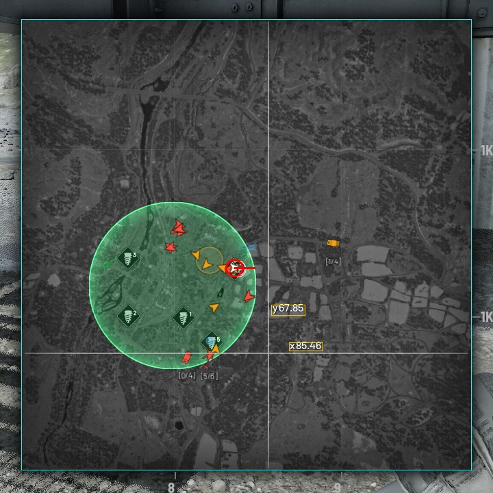

# How it works

The game shows two things the program needs: the coordinates of the point
under the cursor, printed next to the crosshair while the map is open, and the
player's arrow on the map. Everything else is worked out from those.

The code for each step is in [`src/wardogs_spotter/vision`](../src/wardogs_spotter/vision),
one module per step. The numbers below are the constants at the top of each
module.



## 1. Find the map (`panel.py`)

The map can open anywhere and at any size, so nothing about its position is
assumed. Its border and the crosshair are 1 to 2 px bright lines, and that is
what is looked for.

A pixel is on a *ridge* when it is more than 30 gray levels brighter than the
pixels 3 px to its left and right (or above and below). For each column, the
share of its pixels that are on a vertical ridge is computed. A column where
that share passes one half is a vertical line running down most of the frame.
The outermost two are the panel's left and right borders. The same is done for
rows between those two columns, which gives the top and bottom.

Lines found inside the panel are the crosshair. If there are none, the mouse
is off the map.

## 2. Read the coordinates (`labels.py`)

Next to the crosshair the game prints two labels, like `y109.58` above
`x99.23`.

**Isolating the text.** A top-hat filter with a 7x7 kernel keeps only bright
strokes thinner than 7 px, which is text and little else. The crosshair's own
lines are blanked. The threshold is relative to the brightest strokes in the
window, because some labels are drawn dimmer than others.

**Cutting it into characters.** Connected blobs become character boxes. A blob
wider than 11 px is two characters touching (`y7` often does), and is cut at
its thinnest middle column. Boxes that overlap vertically and sit within 5 px
of each other form a line.

**Naming each character.** The game's font never changes, so there is no OCR
engine: each character is compared with examples cut from real screenshots,
kept in `assets/glyphs/<character>/`. A 9x13 window around the character is
normalized and correlated with every example, trying 1 px shifts in each
direction. A character's score is the mean of its three best examples, so
that one odd example can't win alone. The best character above 0.5 names the
glyph.

A line counts only if it reads as a coordinate: `x` or `y`, up to three
digits, a dot, two digits. Anything else is ignored, so a tooltip or a map
label near the cursor does no harm.

The examples were cut at 1920x1080. The `learn` command cuts new ones from a
screenshot when you tell it what the labels say.

## 3. Find the arrow (`arrow.py`)

The player's arrow is white, and so are objective icons, text and the
crosshair. Two things tell it apart.

**It is solid.** A morphological opening (erode, then dilate) removes thin
strokes, which leaves the solid white shapes as candidates.

**It is a notched arrowhead.** Each candidate is matched against the arrow
drawn at four sizes (the arrow grows as the map zooms in) and every 15 degrees
of rotation. Only a score above 0.85 counts: in the sample frames the arrow
scored 0.87 to 0.95, and the white drill icons of objectives at most 0.81.
The winning rotation is then refined in 3 degree steps, and that is the
heading.

This also works when a teammate's arrow covers part of the player's.

## 4. Work out the scale (`tracker.py`)

One frame gives the coordinates of one point: the one under the cursor. When
the cursor is within 8 px of the arrow, that point is the player and the job
is done. Otherwise the map's scale is needed, and one frame can't give it.

Two cursor readings can: if the cursor moved 100 px east and the printed x
grew by 2, the map shows 50 px per unit. But between the two readings the
player may have panned or zoomed the map, so the first reading has to be
carried into the second frame first.

**Following the map.** ORB features are found on the map's texture, leaving
out the crosshair, the labels and tooltips, which move with the cursor. They
are matched with the previous frame's, and RANSAC fits the pan and zoom that
most matches agree on. Fewer than 30 agreeing matches means the view is a
different one, and what was known about the old one is dropped.

**Measuring.** The carried reading and the new one give a scale along each
axis they are at least 30 px apart on. If both axes are available they must
agree within 5%, or the measurement is thrown away. From then on a zoom
multiplies the scale by the zoom factor of the fitted transform.

**Using it.** With a scale and one known point, every map pixel has
coordinates, the arrow's included. The freshest cursor reading is always the
origin, since it is exact.

`MapReference` does this arithmetic and nothing else, which is what
[its tests](../tests/test_map_reference.py) exercise.

## 5. The solution (`ballistics.py`)

One map unit is 100 m: the map's own ruler puts 10 units between kilometer
lines. With the player at `(px, py)` and the target at `(tx, ty)`:

```
range   = 100 * sqrt((tx - px)^2 + (ty - py)^2)   meters
azimuth = atan2(tx - px, ty - py)                 degrees clockwise from north
```

The arguments of `atan2` are swapped from the usual order on purpose: that
measures the angle from the y axis (north) instead of the x axis, and
clockwise, like the compass at the top of the game's screen.

## 6. Drawing over the game (`ui/overlay.py`)

The HUD is a separate window of this program: topmost, layered so that each
pixel has its own transparency, transparent to mouse input, and never
activated. Windows composites it over the game. It follows the game window's
bounds and hides when the game is not the window in front.

Two consequences:

- Windows Graphics Capture hands over the game window's own image, so the HUD
  is never in the frames being read. What is drawn can't confuse the reader.
- Windows composites nothing over a game in exclusive fullscreen. The game has
  to run borderless or windowed.
